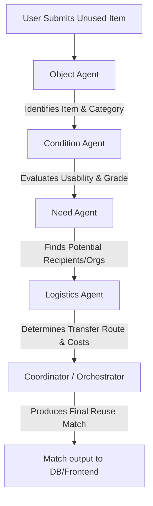

# ReUseMatch

**ReUseMatch** is an autonomous multi-agent platform designed to drive the circular economy by facilitating the matching, evaluation, and logistics of unused items for reuse.

## Workflow Overview

When an item is submitted, it flows through a sequential and coordinated pipeline of specialized agents:



1. **User Submission**: The entry point where an item (and optionally pictures or descriptions) is entered.
2. **Object Agent**: Uses computer vision or text modeling to categorize and identify what the item is.
3. **Condition Agent**: Evaluates the item's usability, determines a condition grade (e.g., New, Like New, Good, Fair), and notes any required repairs.
4. **Need Agent**: Queries recipient databases or social needs lists to identify organizations, shelters, or individuals who can use this item.
5. **Logistics Agent**: Calculates distance, optimal routing, transport methods (pickup, courier, delivery), and estimated costs.
6. **Coordinator / Orchestrator**: Combines the analysis and outputs from all agents to rank and select the optimal reuse match.

---

## Directory Structure

```text
ReUseMatch/
├── frontend/             # Frontend UI (HTML, CSS, JS)
├── backend/              # FastAPI Application
│   ├── routes/           # API endpoints (items, matches)
│   ├── models/           # SQLAlchemy DB schemas
│   └── services/         # Business logic & services
├── agents/               # Autonomous agent modules
│   ├── object_agent/     # Item classification logic
│   ├── condition_agent/  # Quality assessment logic
│   ├── need_agent/       # Need and recipient matching
│   └── logistics_agent/  # Routing and transit calculation
├── orchestration/        # Coordination and pipeline manager
├── database/             # Database connections & setup scripts
├── data/                 # Local data storage (JSON/CSV seeds)
│   ├── items/            # Unused item profiles
│   └── organizations/    # Recipient profile databases
├── tests/                # Unit and integration test suites
├── docs/                 # Architectural and design documentation
├── .gitignore            # Git exclusion list
├── .env.example          # Environment variable template
├── requirements.txt      # Python dependencies list
└── README.md             # Project documentation (this file)
```

---

## Getting Started

### Prerequisites
- Python 3.10+
- MySQL Server

### Backend Setup

1. **Clone the Repository**:
   ```bash
   git clone https://github.com/kanishka-987/ReUseMatch.git
   cd ReUseMatch
   ```

2. **Create and Activate Virtual Environment**:
   ```bash
   python -m venv venv
   # On Windows:
   venv\Scripts\activate
   # On macOS/Linux:
   source venv/bin/activate
   ```

3. **Install Dependencies**:
   ```bash
   pip install -r requirements.txt
   ```

4. **Environment Setup**:
   Copy `.env.example` to `.env` and fill in your local MySQL database configurations and agent API keys:
   ```bash
   cp .env.example .env
   ```

5. **Run the Backend Server**:
   ```bash
   uvicorn backend.app:app --reload
   ```
   The backend API will be available at `http://127.0.0.1:8000`. You can view the interactive documentation at `http://127.0.0.1:8000/docs`.

### Frontend Setup

The frontend resides in the `/frontend` directory. It uses vanilla HTML/CSS/JavaScript.
To run the frontend:
- Open `frontend/index.html` in your browser, or use a local static server like Live Server in VS Code.

### Running Tests

To run pytest check suites:
```bash
pytest
```

## Collaborator Guidelines

1. **Feature Branching**: Create a branch for every agent or backend feature (`feature/object-agent`, `feature/db-setup`, etc.).
2. **Secrets Management**: Never commit your `.env` file to version control. Always update `.env.example` if a new secret configuration is introduced.
3. **API Integrity**: Keep API routes documented in `docs/api.md` updated as endpoints change.
