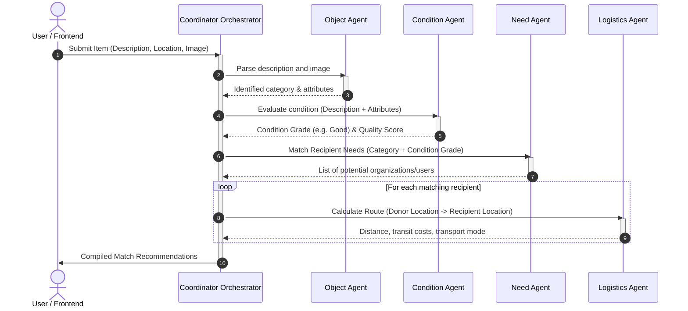

# ReUseMatch Agent Workflow

This document explains the sequential multi-agent execution pipeline. When a user submits an unused item, the orchestrator routes it through four specialized agents.

## Sequence of Execution

---

## Agent Schemas & Protocols

### 1. Object Agent
Identifies item characteristics.
- **Input**:
  - `description` (str): Freeform description provided by user.
  - `image_url` (str, optional): Remote image link.
- **Output**:
  - `identified_name` (str): Standardized name.
  - `category` (str): General taxonomy category (e.g., Furniture, Clothing, Electronics).
  - `detected_attributes` (list[str]): List of key descriptors.

### 2. Condition Agent
Grades usability and checks for damages.
- **Input**:
  - `description` (str): Original item details.
  - `detected_attributes` (list[str]): Identified traits.
- **Output**:
  - `condition_grade` (str): "New", "Like New", "Good", "Fair", or "Poor".
  - `usability_score` (float): Numerical scale (1.0 to 10.0).
  - `requires_repair` (bool): True if repair is recommended.

### 3. Need Agent
Matches the item with recipient需求 (demands).
- **Input**:
  - `category` (str): Categorized classification.
  - `condition_grade` (str): Quality grade.
- **Output**:
  - `matches` (list[dict]): A list of candidate matches, containing:
    - `organization_id` (str)
    - `organization_name` (str)
    - `priority` (str: "High" | "Medium" | "Low")

### 4. Logistics Agent
Computes pathing and transit parameters.
- **Input**:
  - `donor_location` (str): Original location.
  - `recipient_location` (str): Recipient facility location.
- **Output**:
  - `origin` (str)
  - `destination` (str)
  - `distance_km` (float)
  - `estimated_cost_usd` (float)
  - `recommended_mode` (str: e.g. "Local Pickup Courier", "Freight", "Parcel Post")
